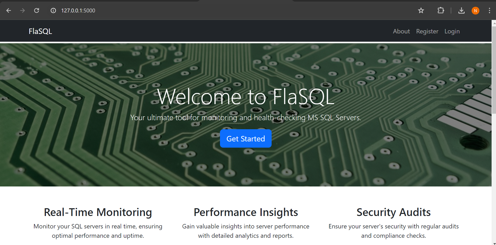
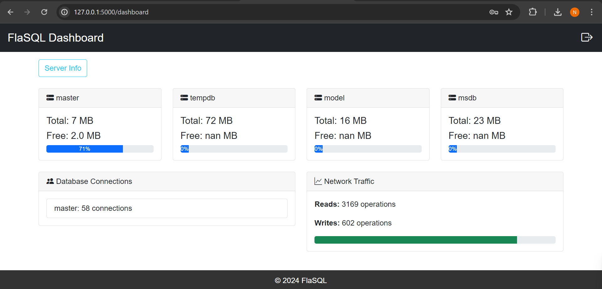
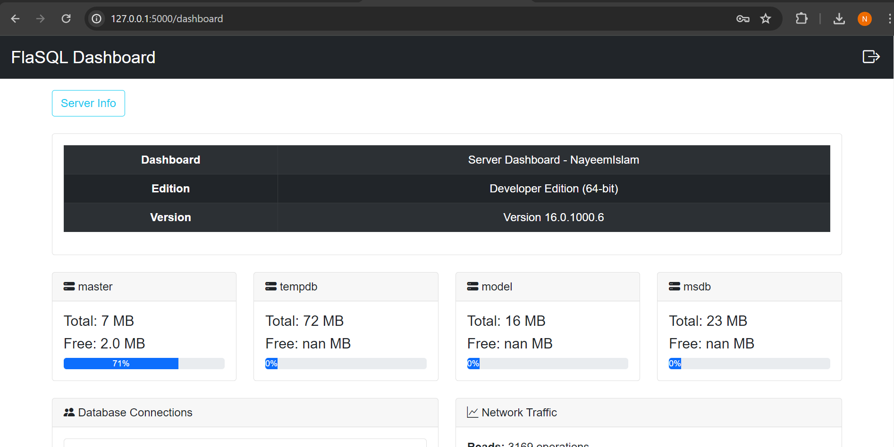
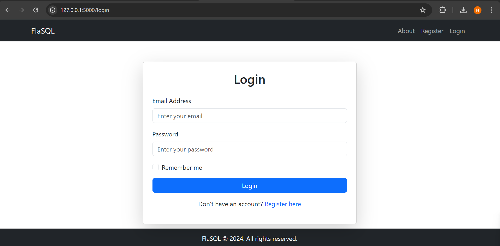
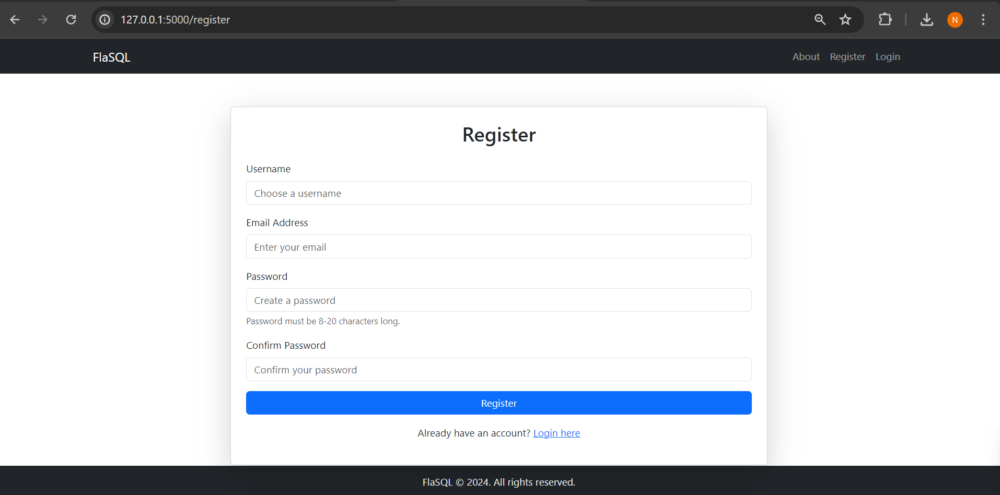

# FlaSQL

FlaSQL is a MS SQL Server Monitoring Platform designed to provide real-time insights and management capabilities for MS SQL Server instances.

## Repository
GitHub Repository: [FlaSQL](https://github.com/NoManNayeem/FlaSQL.git)

## Installation

Follow these steps to get your development environment set up:

1. **Create and activate a Python virtual environment:**
   ```bash
   python -m venv venv
   source venv/bin/activate  # On Windows use `venv\Scripts\activate`
   ```

2. **Change directory to the root of the project:**
   ```bash
   cd path/to/FlaSQL
   ```

3. **Install required packages:**
   ```bash
   pip install -r requirements.txt
   ```

4. **Initiate Flask-Migration:**
   ```bash
   flask db init
   flask db migrate -m "Initial migration."
   flask db upgrade
   ```

5. **Start the development server:**
   ```bash
   python ./run.py
   ```

## Usage

Access the application via the following URLs:
- **Landing Page:** [http://127.0.0.1:5000](http://127.0.0.1:5000)
- **Register:** [http://127.0.0.1:5000/register](http://127.0.0.1:5000/register) - To create a user account
- **Login:** [http://127.0.0.1:5000/login](http://127.0.0.1:5000/login) - To login

## Connecting to MS SQL Server

Go to the 'ConnectDB' page and provide the DB Connection URL in the following format:
```bash
mssql+pyodbc:///?odbc_connect=DRIVER%3D%7BODBC+Driver+17+for+SQL+Server%7D%3BSERVER%3DNAYEEMISLAM%3BDATABASE%3Dmaster%3BTrusted_Connection%3Dyes%3B
```
Alternatively, you can manually provide values for:
- **Driver**
- **Server**
- **Database**
- **Username**
- **Password**

## System Requirements
- Python 3.12.0+


## Project Structure
For more details on the project structure, see the [Project Structure](./ProjectStructure.md) document.


## Project Features
For more details on the project features, see the [Project Features](./Features.md) document.


## Visualization Ideas
For more details on the project UI, see the [Project Visualization Ideas](./VisualizationSuggestion.md) document.


## Screenshots

Here are some visuals of the FlaSQL application in action:

**Landing Page**


**Dashboard**



**Login Page**


**Register Page**


